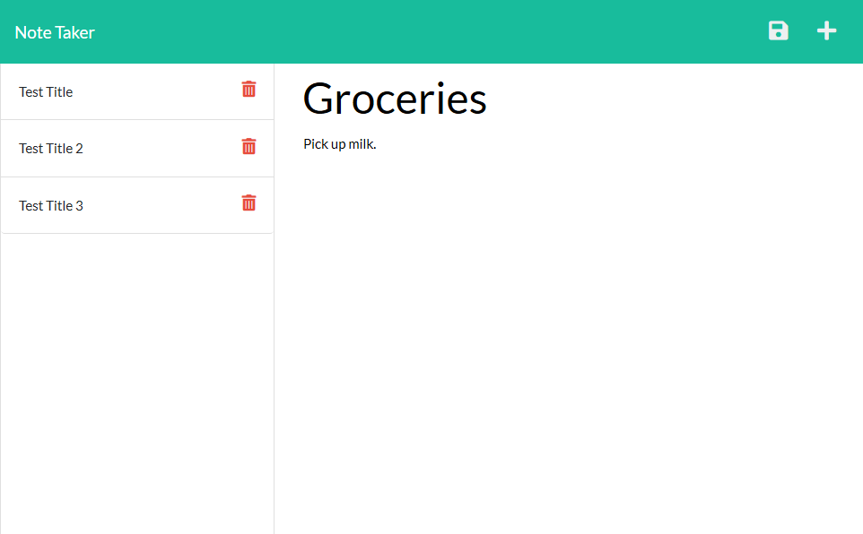

# Note-Taker
## An application to write and save notes using Express.js

## Description:
This application allows the user to write, save, read, and delete notes.

## Table of Contents:
[User Story](#User-Story) 
[Installation](#Installation) 
[Usage](#Usage) 
[Tests](#Tests) 
[Contributions](#Contributions) 
[Contact](#Contact) 
[License](#License) 

## User Story:
- AS A small business owner
- I WANT to be able to write and save notes
- SO THAT I can organize my thoughts and keep track of tasks I need to complete

## Installation:
No installation is required to use the deployed page. If you want to use or develop this application locally, install dependencies by running `npm i` in your terminal in the root folder.

## Usage:
 

## Tests:
No tests are currently included.

## Contributions:
Technologies used include JavaScript, Node.js, and Express.js

## Contact:
Check out my [Github](https://github.com/MonsAltus). 
Email me at <hacklander.dev@gmail.com>

## License:
Covered under the [MIT License](https://github.com/MonsAltus/Note-Taker/blob/main/LICENSE).
